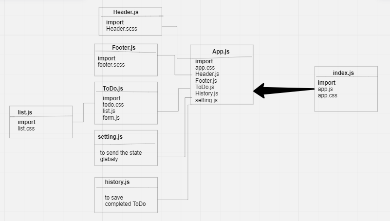

# todo-app

[github Pages Link](https://todo-app-ecru-seven.vercel.app/)

## useForm hook
useForm is a custom hook for managing forms with ease. It takes one object as optional argument.
## UML Diagram

